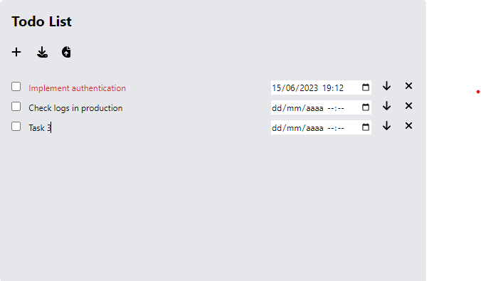

**TODO-CHROME-EXTENSION**

1. Create and manage Todo items: The extension allows users to create, edit, and delete Todo items with a name, due date, and description.

2. Interactive user interface: The extension provides an intuitive user interface where users can interact with their Todo items.

3. Mark tasks as complete: Users can mark Todo items as complete by checking the corresponding checkbox. Completed tasks are visually indicated with a strikethrough and display the date when they were finished.

4. Due date notifications: The extension highlights Todo items that are due soon, specifically within the next 3 hours, by changing their text color to red.

5. Data persistence: The extension saves and retrieves the Todo list using the Chrome Storage API, allowing users to access their Todo items across browser sessions.

6. Download and upload functionality: Users can download their Todo list as a JSON file and later upload it to restore their previous tasks.

7. These features provide users with a simple and effective Todo List extension, allowing them to organize and manage their tasks conveniently within the Chrome browser.

Manifest.json
- manifest_version: This property specifies the version of the manifest file format. In this case, it's set to 3, indicating that the extension is using Manifest v3 format.
- name: The name of your Chrome extension. In this example, it's set to "Todo List".
- version: The version number of your extension. Here, it's set to "1.0".
- description: A brief description of your extension, which provides an overview of its purpose. In this case, it's described as "A Simple and effective todo list".
- icons: This property is used to define icons for your extension. In this example, there is an icon with a size of 16 pixels specified as "icon16.png".
- action: The action property defines the default behavior when the extension's icon is clicked. It contains the properties "default_popup" and "default_icon". The "default_popup" specifies the HTML file to be displayed as the extension's popup when clicked, which is set as "index.html". The "default_icon" specifies the icon to be used for the extension, which is the same "icon16.png" as specified earlier.
- permissions: This property lists the permissions required by the extension to function properly. In this example, it requires the "activeTab" permission, which allows the extension to interact with the currently active tab, and the "storage" permission, which allows the extension to store data locally.
- host_permissions: This property specifies the host permissions required by the extension. In this case, it uses the wildcard pattern ":///*", which grants the extension access to all URLs.

- web_accessible_resources: This property lists the resources that are accessible from web pages. It contains an array with objects specifying the resources and their matching patterns. In this example, it includes "index.html" and "style.css" as local resources, and "https://cdn.tailwindcss.com/your-tailwind-css-file.css" as an external resource. The matches property "", set as [":///"], allows these resources to be accessed from any URL.

These properties together define the necessary information and behavior of your Chrome extension.
 
  